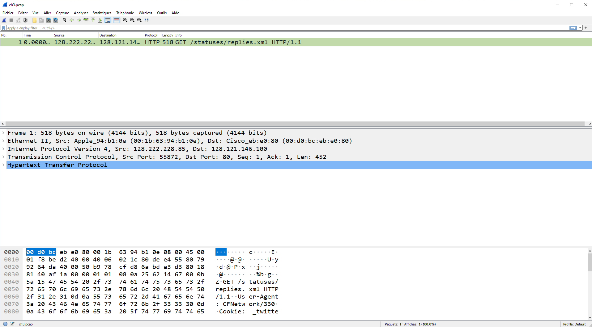
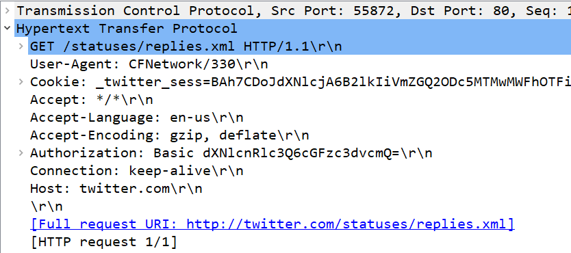
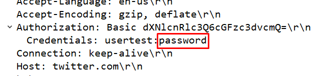

# Authentification Twitter 
## Niveau 2

### Enoncé

Une session d’authentification twitter a été capturée. Retrouvez le mot de passe de l’utilisateur dans cette capture réseau.

## Solution

Ici pour démarrer l’exercice il fallait dans un premier temps qu’on télécharge le fichier. Une fois fait nous l’avons ouvert grâce à wireshark.

A l’intérieur du fichier il y avait des genres de sous dossier dont un qui s’appelait « Hypertext Transfer Protocol » :

Et enfin « Autorization » :

On retrouve donc le mot de passe derrière les deux points, entouré en rouge.