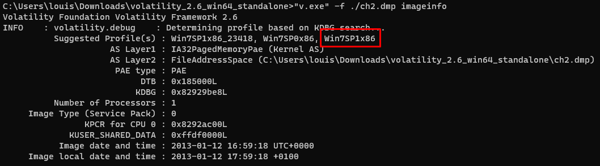
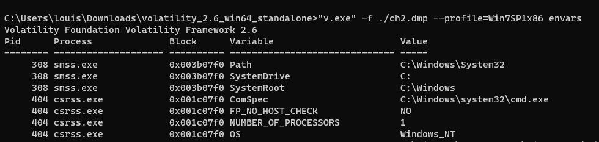
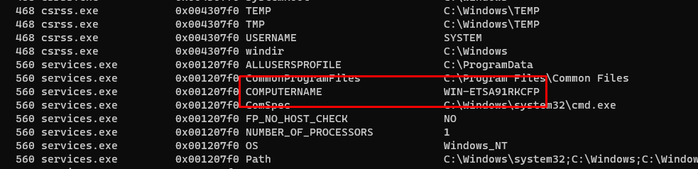

# File Upload - Type MIME
## Niveau 2

## Énnoncé

Berthier, grâce à vous la machine a été identifiée, vous avez demandé un dump de la mémoire vive de la machine et vous aimeriez bien jeter un coup d’œil aux logs de l’antivirus. Malheureusement, vous n’avez pas pensé à noter le nom de cette machine. Heureusement ce n’est pas un problème, vous disposez du dump de memoire.

Le mot de passe de validation est le nom de la machine.

Le hash md5 du dump mémoire décompressé est e3a902d4d44e0f7bd9cb29865e0a15de

## Solution

On récupère grâce à Volatility les informations du fichier.

On récupère un nom de profil aléatoire et on va voir les informations de son profil.

    