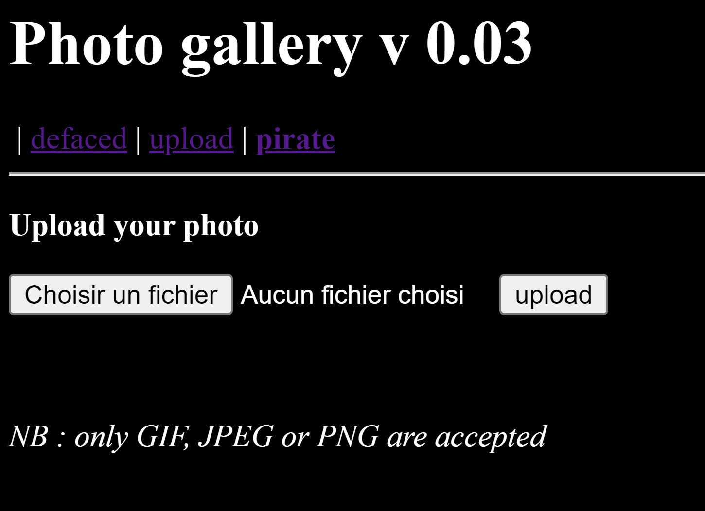
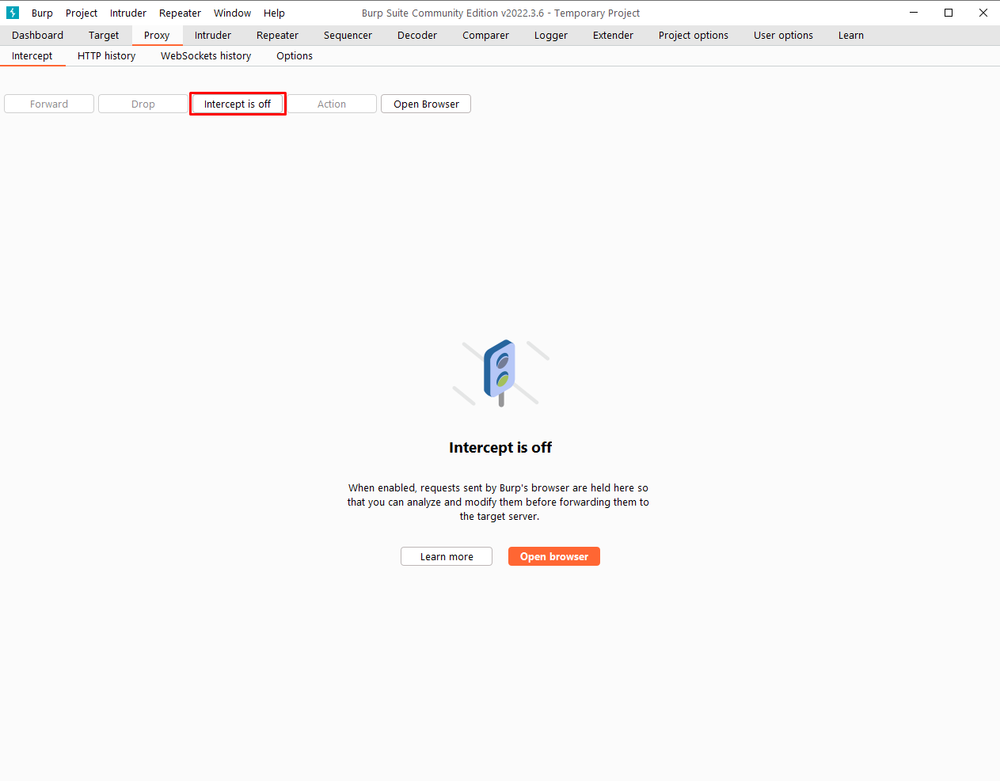
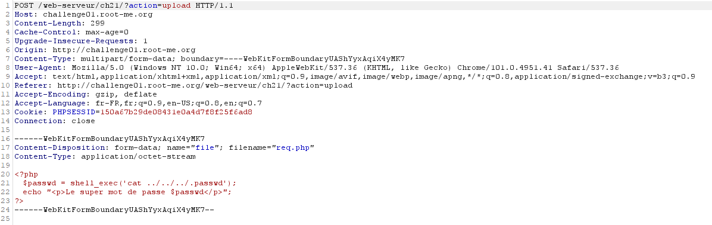
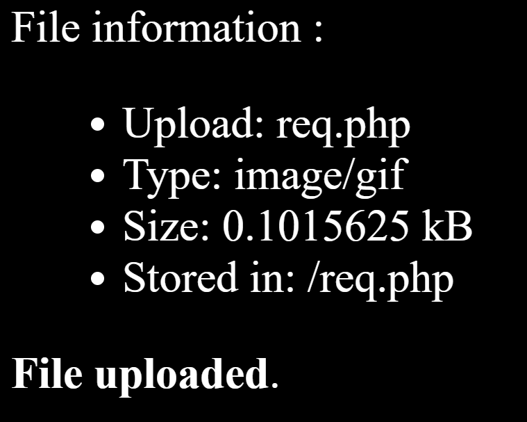
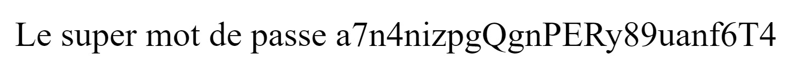

# File Upload - Type MIME
## Niveau 2

## Énnoncé

Votre objectif est de compromettre cette galerie photo en y uploadant du code PHP.
Récupérez le mot de passe de validation dans le fichier .passwd à la racine de l’application.

## Solution

Quand on arrive sur le site on peut voir que l'on peut uploader des fichiers.

La première chose qui nous vient à l'esprit et d'uploader un script nous permettant d'afficher le fichier .passwd, mais il n'est pas possible d'envoyer un autre fichier qu'une image de type .png, .gif ou .jpg. Le fichier en ressources associées nous faisait comprendre qu'il y avait une faille de ce côté là.

J'utilise alors la suite Burp, et sa fonction permettant d'intercepter les requêtes et de les modifiers.

J'intercepte la requête POST, change le type de fichier, et passe mon fichier php.

J'envoie la requête, et voilà !

Je retrouve bien mon fichier dans les fichiers uploader :

Je retouve maintenant le super mot de passe :

