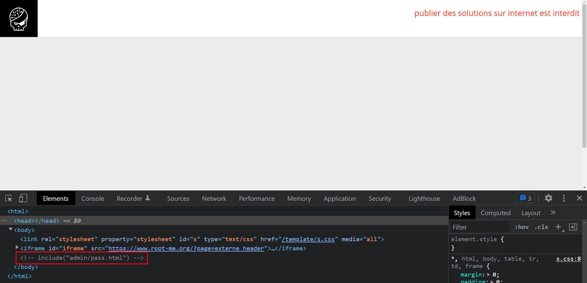
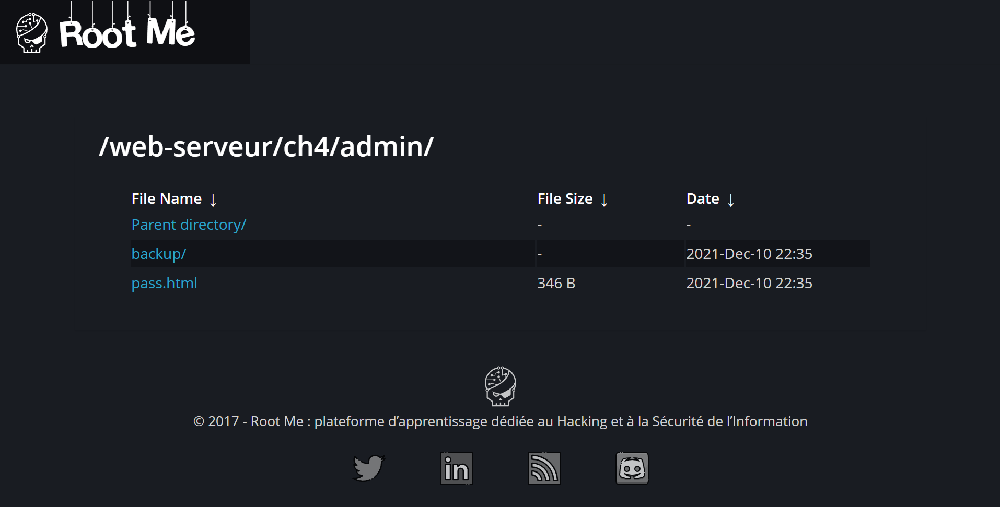
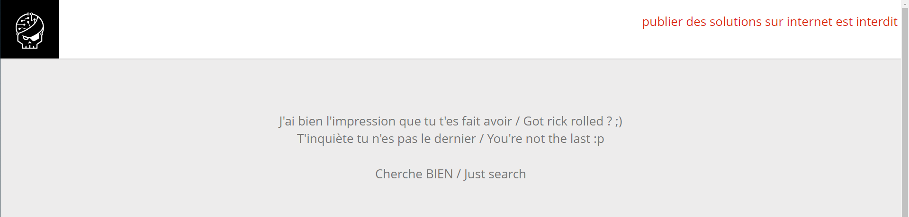
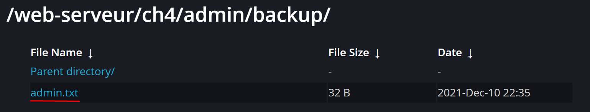

# HTTP - Directory Indexing
## Niveau 2

### Enoncé

Il n'y a pas d'énoncé pour cet exercice.

## Notre Solution
### Première étape : Inspecter la page web

Lorsqu'on lance l'exercice on arrive sur une page web, notre premiuer reflexe est donc de l'inspecter.

### Deuxième étape : l’analyse 
On voit ainsi en commentaire un chemin "admin/pass.html".

### Troisième étape : aller au chemin 
Il faut savoir que quand j'ai taper le chemin je me suis tromper et j'ai écrit seulement admin puis j'ai taper entrée. Ce qui m'a ammener à la page ci-dessous.

je suis ensuite aller dans le chemin que je voulais acceder de base donc pass.html je me suis ensuite retrouver sur une page troll.

### Quatrième étape : trouver le mot de passe

En retournant en arrière j'ai regardé le chemin backup il y avait le fichier admin.txt 

Lorsque j'ai ouvert le fichier a l'intérieur était noté le mot de passe : LINUX

